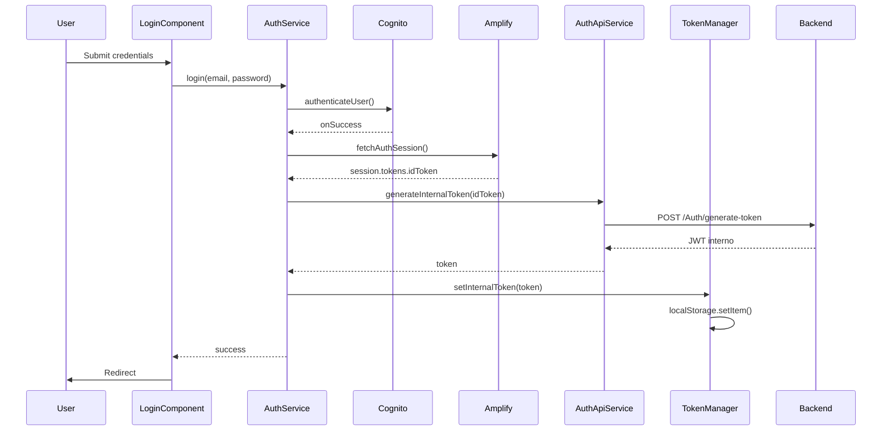

# Plan de Implementación: Sistema de Validación de Tokens (Adaptado para Amplify)

## Descripción General

Este documento describe el plan de implementación para integrar el sistema de gestión de tokens JWT propios en los proyectos frontend. El sistema mantiene compatibilidad con AWS Cognito como fallback y añade un token JWT propio que se genera después del login exitoso con Cognito.

**Importante:** Este plan está adaptado para proyectos que usan **AWS Amplify** con `fetchAuthSession()` para el refresh automático de tokens de Cognito.

## API de Autenticación

### Endpoints Disponibles

Según la documentación Swagger de `https://auth-dev.differentroads.es`:

- **POST `/api/Auth/generate-token`**: Genera token JWT propio validando token de Cognito
  - Request: `{ cognitoToken: string }`
  - Response: Token JWT propio (string)
  
- **GET `/api/Auth/validate-token`**: Valida token JWT (Bearer token en header Authorization)
  - Headers: `Authorization: Bearer {token}`
  - Response: Estado de validación
  
- **POST `/api/Auth/validate-token`**: Valida token JWT (token en body, para pruebas)
  - Request: `{ token: string }`
  
- **POST `/api/Auth/verify-cognito-token`**: Solo para depuración backend (no usar desde frontend)

### URL Base

La URL base de la API de autenticación debe configurarse en los archivos de environment:
- Desarrollo: `https://auth-dev.differentroads.es/api`
- Pre-producción: `https://auth-pre.differentroads.es/api`
- Producción: `https://auth.differentroads.es/api`

Ya está configurada como `usersApiUrl` en los environments existentes.

## Arquitectura de la Solución



## Tipologías de Proyectos

### Tipología 1: Proyectos con Login Obligatorio

**Proyectos afectados:**
- `core.differentroads.middle`
- `core.differentroads.middle-atc`
- `core.differentroads.touroperacion`

**Características:**
- Usan `amazon-cognito-identity-js` para login + Amplify para refresh
- Tienen `AuthGuard` que verifica autenticación y permisos específicos
- Todas las rutas (excepto `/login`) requieren autenticación
- Verifican permisos específicos:
  - `middle`: `hasMiddleAccess`
  - `middle-atc`: `hasMiddleAtcAccess`
  - `touroperacion`: `hasTourOperationAccess`

### Tipología 2: Proyecto Web Pública/Privada

**Proyecto afectado:**
- `core.differentroads.ui`

**Características:**
- Usa AWS Amplify para autenticación
- Tiene rutas públicas (home, tours, etc.) y privadas (profile, bookings, checkout)
- Usa `AuthenticateService` con `amazon-cognito-identity-js` y AWS SDK

## Cambios Clave para Amplify

| Aspecto | Plan Original | Plan Adaptado |
|---------|--------------|---------------|
| Obtener idToken para generar token interno | `result.getIdToken().getJwtToken()` del callback `onSuccess` | `fetchAuthSession()` de `aws-amplify/auth` |
| Refresh del token de Cognito | `userPool.getCurrentUser().getSession()` | `fetchAuthSession()` (Amplify lo refresca automáticamente) |
| Dependencia adicional | Ninguna | Ya existe: `aws-amplify/auth` |

---

## Fases de Implementación

### Fase 1: Configuración y Servicios Base

#### Tarea 1.1: Crear `AuthApiService`

**Archivo a crear:** `src/app/core/services/auth-api.service.ts`

**Implementación:**

```typescript
import { Injectable } from '@angular/core';
import {
  HttpClient,
  HttpErrorResponse,
  HttpHeaders,
} from '@angular/common/http';
import { Observable, throwError } from 'rxjs';
import { catchError, map } from 'rxjs/operators';
import { environment } from '../../../environments/environment';

interface GenerateTokenRequest {
  cognitoToken: string;
}

interface GenerateTokenResponse {
  token: string;
}

interface ValidateTokenResponse {
  isValid: boolean;
}

@Injectable({
  providedIn: 'root',
})
export class AuthApiService {
  private readonly API_URL = `${environment.usersApiUrl}/Auth`;

  constructor(private http: HttpClient) {}

  /**
   * Genera un token JWT interno a partir del token de Cognito
   * @param cognitoToken El ID token de Cognito
   * @returns Observable con el token JWT interno
   */
  generateInternalToken(cognitoToken: string): Observable<string> {
    const requestBody: GenerateTokenRequest = {
      cognitoToken: cognitoToken,
    };

    return this.http
      .post<GenerateTokenResponse | string>(
        `${this.API_URL}/generate-token`,
        requestBody,
        {
          headers: new HttpHeaders({
            'Content-Type': 'application/json',
          }),
        }
      )
      .pipe(
        map((response) => {
          if (typeof response === 'string') {
            return response;
          }
          return response.token || '';
        }),
        catchError((error: HttpErrorResponse) => {
          console.error('Error generating internal token:', error);
          return throwError(() => error);
        })
      );
  }

  /**
   * Valida un token JWT interno
   * @param token El token JWT interno a validar
   * @returns Observable con el estado de validación
   */
  validateInternalToken(token: string): Observable<boolean> {
    const headers = new HttpHeaders({
      Authorization: `Bearer ${token}`,
    });

    return this.http
      .get<ValidateTokenResponse | boolean>(`${this.API_URL}/validate-token`, {
        headers,
      })
      .pipe(
        map((response) => {
          if (typeof response === 'boolean') {
            return response;
          }
          return response.isValid || false;
        }),
        catchError((error: HttpErrorResponse) => {
          if (error.status === 401) {
            return throwError(() => new Error('Token inválido o expirado'));
          }
          console.error('Error validating internal token:', error);
          return throwError(() => error);
        })
      );
  }
}
```

#### Tarea 1.2: Crear `TokenManagerService`

**Archivo a crear:** `src/app/core/services/token-manager.service.ts`

**Implementación:**

```typescript
import { Injectable } from '@angular/core';

const TOKEN_STORAGE_KEY = 'internalAuthToken';

interface JwtPayload {
  exp?: number;
  iat?: number;
  [key: string]: unknown;
}

@Injectable({
  providedIn: 'root',
})
export class TokenManagerService {
  /**
   * Obtiene el token interno almacenado
   * @returns El token o null si no existe
   */
  getInternalToken(): string | null {
    try {
      return localStorage.getItem(TOKEN_STORAGE_KEY);
    } catch (error) {
      console.error('Error reading token from localStorage:', error);
      return null;
    }
  }

  /**
   * Guarda el token interno en localStorage
   * @param token El token JWT a guardar
   */
  setInternalToken(token: string): void {
    try {
      localStorage.setItem(TOKEN_STORAGE_KEY, token);
    } catch (error) {
      console.error('Error saving token to localStorage:', error);
    }
  }

  /**
   * Elimina el token interno de localStorage
   */
  clearInternalToken(): void {
    try {
      localStorage.removeItem(TOKEN_STORAGE_KEY);
    } catch (error) {
      console.error('Error removing token from localStorage:', error);
    }
  }

  /**
   * Verifica si existe un token interno almacenado
   * @returns true si existe un token
   */
  hasInternalToken(): boolean {
    const token = this.getInternalToken();
    return token !== null && token !== '';
  }

  /**
   * Verifica si el token está expirado
   * @returns true si el token está expirado o no existe
   */
  isTokenExpired(): boolean {
    const token = this.getInternalToken();
    if (!token) {
      return true;
    }

    try {
      const payload = this.decodeToken(token);
      if (!payload || !payload.exp) {
        return true;
      }

      const expirationTime = payload.exp * 1000;
      const currentTime = Date.now();
      return currentTime >= expirationTime;
    } catch (error) {
      console.error('Error decoding token:', error);
      return true;
    }
  }

  /**
   * Verifica si el token está próximo a expirar
   * @param minutesBeforeExpiration Minutos antes de la expiración (default: 5)
   * @returns true si el token expira pronto o ya expiró
   */
  isTokenExpiringSoon(minutesBeforeExpiration: number = 5): boolean {
    const token = this.getInternalToken();
    if (!token) {
      return true;
    }

    try {
      const payload = this.decodeToken(token);
      if (!payload || !payload.exp) {
        return true;
      }

      const expirationTime = payload.exp * 1000;
      const currentTime = Date.now();
      const millisecondsBeforeExpiration = minutesBeforeExpiration * 60 * 1000;

      return currentTime >= expirationTime - millisecondsBeforeExpiration;
    } catch (error) {
      console.error('Error decoding token:', error);
      return true;
    }
  }

  /**
   * Decodifica el payload de un token JWT
   * @param token El token JWT
   * @returns El payload decodificado o null si hay error
   */
  private decodeToken(token: string): JwtPayload | null {
    try {
      const parts = token.split('.');
      if (parts.length !== 3) {
        throw new Error('Invalid token format');
      }

      const payload = parts[1];
      // Reemplazar caracteres de Base64URL a Base64 estándar
      const base64 = payload.replace(/-/g, '+').replace(/_/g, '/');
      // Agregar padding si es necesario
      const padded = base64 + '='.repeat((4 - (base64.length % 4)) % 4);
      // Decodificar
      const decoded = atob(padded);
      return JSON.parse(decoded) as JwtPayload;
    } catch (error) {
      console.error('Error decoding JWT token:', error);
      return null;
    }
  }
}
```

---

### Fase 2: Actualizar Servicio de Autenticación

#### Tarea 2.1: Modificar `AuthenticateService`

**Archivo a modificar:** `src/app/core/services/auth-service.service.ts`

**Cambios necesarios:**

1. **Agregar imports:**
```typescript
import { firstValueFrom } from 'rxjs';
import {
  getCurrentUser,
  fetchUserAttributes,
  fetchAuthSession,  // NUEVO: para obtener tokens frescos
} from 'aws-amplify/auth';
import { AuthApiService } from './auth-api.service';
import { TokenManagerService } from './token-manager.service';
```

2. **Inyectar servicios en constructor:**
```typescript
constructor(
  private router: Router,
  private authApiService: AuthApiService,
  private tokenManagerService: TokenManagerService
) {
  // ... resto del constructor existente
}
```

3. **Modificar método `login()` (convertir callback a async):**
```typescript
login(emailaddress: string, password: string): Promise<unknown> {
  const authenticationDetails = new AuthenticationDetails({
    Username: emailaddress,
    Password: password,
  });

  this.cognitoUser = this.getUserData(emailaddress);

  return new Promise((resolve, reject) => {
    this.cognitoUser.authenticateUser(authenticationDetails, {
      onSuccess: async (result: unknown) => {
        // Actualizar los BehaviorSubjects
        this.isAuthenticated.next(true);
        this.currentUserCognitoId.next(this.cognitoUser.getUsername());

        // Obtener el email desde los atributos del usuario
        this.cognitoUser.getUserAttributes(
          (err: Error | undefined, attributes: { Name: string; Value: string }[] | undefined) => {
            if (!err && attributes) {
              const emailAttribute = attributes.find(
                (attr) => attr.Name === 'email'
              );
              if (emailAttribute) {
                this.currentUserEmail.next(emailAttribute.Value);
              } else {
                this.currentUserEmail.next(emailaddress);
              }
            } else {
              this.currentUserEmail.next(emailaddress);
            }
            this.userAttributesChanged.next();
          }
        );

        // NUEVO: Generar token interno usando Amplify para obtener idToken
        try {
          const session = await fetchAuthSession();
          const idToken = session.tokens?.idToken?.toString();

          if (idToken) {
            this.authApiService.generateInternalToken(idToken).subscribe({
              next: (internalToken: string) => {
                this.tokenManagerService.setInternalToken(internalToken);
                resolve(result);
              },
              error: (error: unknown) => {
                console.warn(
                  'Error generating internal token, continuing with Cognito:',
                  error
                );
                resolve(result); // Fallback a Cognito
              },
            });
          } else {
            console.warn('No idToken available from Amplify session');
            resolve(result);
          }
        } catch (sessionError) {
          console.warn(
            'Error fetching auth session, continuing with Cognito:',
            sessionError
          );
          resolve(result);
        }
      },
      newPasswordRequired: () => {
        // Manejar según necesidad
      },
      onFailure: (error: unknown) => {
        reject(error);
      },
    });
  });
}
```

4. **Modificar método `logOut()`:**
```typescript
logOut(): void {
  // NUEVO: Limpiar token interno antes de hacer logout de Cognito
  this.tokenManagerService.clearInternalToken();

  const currentUser = this.userPool.getCurrentUser();
  if (currentUser) {
    currentUser.signOut();
    // Actualizar los BehaviorSubjects
    this.isAuthenticated.next(false);
    this.currentUserEmail.next('');
    this.currentUserCognitoId.next('');
    this.userAttributesChanged.next();

    this.router.navigate(['/login']);
  }
}
```

5. **Agregar nuevos métodos para refresh:**
```typescript
/**
 * Renueva el token interno usando el token de Cognito de Amplify
 * @returns Promise con el nuevo token interno
 */
async refreshInternalToken(): Promise<string> {
  const session = await fetchAuthSession();
  const idToken = session.tokens?.idToken?.toString();

  if (!idToken) {
    throw new Error('No se pudo obtener token de Cognito');
  }

  const internalToken = await firstValueFrom(
    this.authApiService.generateInternalToken(idToken)
  );
  this.tokenManagerService.setInternalToken(internalToken);
  return internalToken;
}

/**
 * Renueva el token interno si está próximo a expirar
 * @param minutesBeforeExpiration Minutos antes de la expiración (default: 5)
 * @returns Promise con true si se renovó el token
 */
async refreshInternalTokenIfNeeded(
  minutesBeforeExpiration: number = 5
): Promise<boolean> {
  if (this.tokenManagerService.isTokenExpiringSoon(minutesBeforeExpiration)) {
    try {
      await this.refreshInternalToken();
      return true;
    } catch (error) {
      console.warn('Failed to refresh internal token:', error);
      return false;
    }
  }
  return false;
}
```

---

### Fase 3: Interceptor HTTP

#### Tarea 3.1: Crear `AuthTokenInterceptor`

**Archivo a crear:** `src/app/core/interceptors/auth-token.interceptor.ts`

**Implementación:**

```typescript
import {
  HttpInterceptor,
  HttpRequest,
  HttpHandler,
  HttpEvent,
  HttpErrorResponse,
} from '@angular/common/http';
import { Injectable } from '@angular/core';
import { Observable, throwError, BehaviorSubject, from } from 'rxjs';
import { catchError, switchMap, filter, take } from 'rxjs/operators';
import { Router } from '@angular/router';
import { TokenManagerService } from '../services/token-manager.service';
import { AuthenticateService } from '../services/auth-service.service';

@Injectable()
export class AuthTokenInterceptor implements HttpInterceptor {
  private isRefreshing = false;
  private refreshTokenSubject: BehaviorSubject<string | null> =
    new BehaviorSubject<string | null>(null);

  constructor(
    private tokenManagerService: TokenManagerService,
    private authService: AuthenticateService,
    private router: Router
  ) {}

  intercept(
    request: HttpRequest<unknown>,
    next: HttpHandler
  ): Observable<HttpEvent<unknown>> {
    const token = this.tokenManagerService.getInternalToken();

    if (token) {
      request = this.addTokenHeader(request, token);
    }

    return next.handle(request).pipe(
      catchError((error: HttpErrorResponse) => {
        if (error.status === 401 && token) {
          return this.handle401Error(request, next);
        }
        return throwError(() => error);
      })
    );
  }

  private addTokenHeader(
    request: HttpRequest<unknown>,
    token: string
  ): HttpRequest<unknown> {
    return request.clone({
      setHeaders: {
        Authorization: `Bearer ${token}`,
      },
    });
  }

  private handle401Error(
    request: HttpRequest<unknown>,
    next: HttpHandler
  ): Observable<HttpEvent<unknown>> {
    if (!this.isRefreshing) {
      this.isRefreshing = true;
      this.refreshTokenSubject.next(null);

      return from(this.authService.refreshInternalToken()).pipe(
        switchMap((newToken: string) => {
          this.isRefreshing = false;
          this.refreshTokenSubject.next(newToken);
          return next.handle(this.addTokenHeader(request, newToken));
        }),
        catchError((error: unknown) => {
          this.isRefreshing = false;
          this.tokenManagerService.clearInternalToken();
          this.router.navigate(['/login']);
          return throwError(() => error);
        })
      );
    } else {
      return this.refreshTokenSubject.pipe(
        filter((token) => token !== null),
        take(1),
        switchMap((token) =>
          next.handle(this.addTokenHeader(request, token as string))
        )
      );
    }
  }
}
```

#### Tarea 3.2: Registrar interceptor en `app.module.ts`

**Archivo a modificar:** `src/app/app.module.ts`

**IMPORTANTE:** En Angular 15+ con `provideHttpClient()`, es necesario usar `withInterceptorsFromDi()` para que los interceptors basados en clases funcionen correctamente.

**Cambios:**

1. Actualizar imports:
```typescript
import {
  provideHttpClient,
  withInterceptorsFromDi,
  HTTP_INTERCEPTORS,
} from '@angular/common/http';

// HTTP Interceptors
import { AuthTokenInterceptor } from './core/interceptors/auth-token.interceptor';
```

2. Actualizar providers (**ORDEN CRÍTICO**):
```typescript
providers: [
  // ... otros providers ...
  
  // HTTP Interceptors (DEBE estar ANTES de provideHttpClient)
  {
    provide: HTTP_INTERCEPTORS,
    useClass: AuthTokenInterceptor,
    multi: true,
  },

  // Angular Configuration
  provideAnimationsAsync(),
  provideHttpClient(withInterceptorsFromDi()), // OBLIGATORIO: usar withInterceptorsFromDi()
  
  // ... resto de providers ...
]
```

**⚠️ Notas críticas:** 
- El interceptor **DEBE** estar registrado **ANTES** de `provideHttpClient()` en el array de providers
- Es **OBLIGATORIO** usar `withInterceptorsFromDi()` como parámetro de `provideHttpClient()` en Angular 15+
- Sin `withInterceptorsFromDi()`, el interceptor no se ejecutará y las peticiones no tendrán el header Authorization

---

### Fase 4: Actualizar AuthGuard

#### Tarea 4.1: Modificar `AuthGuard`

**Archivo a modificar:** `src/app/shared/auth.guard.ts`

**Implementación completa:**

```typescript
import { Injectable } from '@angular/core';
import {
  CanActivate,
  ActivatedRouteSnapshot,
  RouterStateSnapshot,
  Router,
} from '@angular/router';
import { Observable, of, from } from 'rxjs';
import { map, catchError, switchMap, take } from 'rxjs/operators';
import { AuthenticateService } from '../core/services/auth-service.service';
import { UsersNetService } from '../core/services/usersNet.service';
import { TokenManagerService } from '../core/services/token-manager.service';

@Injectable({
  providedIn: 'root',
})
export class AuthGuard implements CanActivate {
  constructor(
    private authService: AuthenticateService,
    private usersNetService: UsersNetService,
    private tokenManagerService: TokenManagerService,
    private router: Router
  ) {}

  canActivate(
    route: ActivatedRouteSnapshot,
    state: RouterStateSnapshot
  ): Observable<boolean> | boolean {
    // 1. Verificar si hay token interno almacenado
    if (this.tokenManagerService.hasInternalToken()) {
      // 2. Verificar expiración local del token
      if (this.tokenManagerService.isTokenExpired()) {
        // Token expirado, intentar renovar
        return this.handleTokenRefresh();
      } else {
        // Token válido localmente, verificar permisos
        return this.verifyAccess();
      }
    }

    // 3. No hay token interno, verificar autenticación con Cognito (fallback)
    if (!this.authService.isUserLoggedIn()) {
      this.router.navigate(['/login']);
      return false;
    }

    // Usuario autenticado con Cognito pero sin token interno
    return this.verifyAccess();
  }

  /**
   * Maneja la renovación del token cuando está expirado
   */
  private handleTokenRefresh(): Observable<boolean> {
    return from(this.authService.refreshInternalToken()).pipe(
      switchMap(() => {
        // Token renovado exitosamente, verificar permisos
        return this.verifyAccess();
      }),
      catchError((error) => {
        console.warn('Error al renovar token interno:', error);
        // Si falla la renovación, verificar si hay sesión de Cognito
        if (this.authService.isUserLoggedIn()) {
          // Hay sesión de Cognito, permitir verificar permisos
          return this.verifyAccess();
        }
        // No hay sesión válida, redirigir a login
        this.router.navigate(['/login']);
        return of(false);
      })
    );
  }

  /**
   * Verifica el acceso del usuario (adaptar según el proyecto)
   * - middle: hasMiddleAccess
   * - middle-atc: hasMiddleAtcAccess
   * - touroperacion: hasTourOperationAccess
   */
  private verifyAccess(): Observable<boolean> {
    return this.authService.getCognitoId().pipe(
      take(1),
      switchMap((cognitoId) => {
        if (!cognitoId) {
          this.router.navigate(['/login']);
          return of(false);
        }

        return this.usersNetService.getUsersByCognitoId(cognitoId).pipe(
          map((users) => {
            if (users && users.length > 0) {
              const user = users[0];
              // ADAPTAR: Cambiar según el proyecto
              // - middle: user.hasMiddleAccess
              // - middle-atc: user.hasMiddleAtcAccess
              // - touroperacion: user.hasTourOperationAccess
              if (user.hasTourOperationAccess) {
                return true;
              } else {
                console.warn('Usuario no tiene acceso');
                this.router.navigate(['/login'], {
                  queryParams: { accessDenied: 'noAccess' },
                });
                return false;
              }
            } else {
              console.warn('Usuario no encontrado en la base de datos');
              this.router.navigate(['/login'], {
                queryParams: { accessDenied: 'notFound' },
              });
              return false;
            }
          }),
          catchError((error) => {
            console.error('Error al verificar acceso:', error);
            this.router.navigate(['/login']);
            return of(false);
          })
        );
      }),
      catchError((error) => {
        console.error('Error al obtener CognitoId:', error);
        this.router.navigate(['/login']);
        return of(false);
      })
    );
  }
}
```

---

## Fase 5: Testing y Validación

### Checklist de Verificación

- [ ] Login genera y guarda token interno
- [ ] Token interno se almacena en `localStorage` como `internalAuthToken`
- [ ] Interceptor agrega header `Authorization: Bearer {token}` (verificar en DevTools > Network)
- [ ] Renovación automática cuando token está próximo a expirar
- [ ] Logout limpia token interno
- [ ] Guard verifica token interno antes de permisos
- [ ] Manejo de errores 401 renueva token automáticamente
- [ ] Fallback a Cognito funciona si token interno falla

### Verificación del Interceptor

Para verificar que el interceptor funciona:

1. Abrir DevTools del navegador (F12)
2. Ir a la pestaña Network
3. Realizar una petición HTTP (cualquier llamada a la API)
4. Seleccionar la petición en la lista
5. Ir a la pestaña Headers
6. Verificar que existe el header `Authorization: Bearer [token]`

Si no aparece el header:
- Verificar que `withInterceptorsFromDi()` esté presente
- Verificar el orden de providers (interceptor ANTES de provideHttpClient)
- Reiniciar el servidor de desarrollo
- Verificar que el token existe en `localStorage` con la clave `internalAuthToken`

---

## Archivos a Crear

1. `src/app/core/services/auth-api.service.ts`
2. `src/app/core/services/token-manager.service.ts`
3. `src/app/core/interceptors/auth-token.interceptor.ts`

## Archivos a Modificar

1. `src/app/core/services/auth-service.service.ts`
2. `src/app/app.module.ts`
3. `src/app/shared/auth.guard.ts`

---

## Consideraciones Técnicas

### Manejo de Errores

- Si `generateInternalToken` falla, mantener funcionalidad con Cognito (fallback)
- Si validación falla, intentar renovar antes de hacer logout
- Loggear errores de autenticación para debugging (sin exponer tokens)

### Performance

- Verificar expiración del token localmente (sin llamadas al backend)
- Renovar token on-demand cuando sea necesario (similar a Cognito)
- Usar `localStorage` para persistir token entre sesiones
- La validación real se hace en el backend cuando el token se envía en las peticiones HTTP

### Seguridad

- No exponer tokens en logs
- Limpiar tokens al hacer logout
- Validar tokens antes de usarlos en peticiones HTTP
- El backend valida el token cuando se recibe

### Compatibilidad

- Mantener compatibilidad con sistema actual de Cognito durante migración
- Permitir fallback a Cognito si nuevo sistema falla
- Migración gradual sin romper funcionalidad existente

---

## Diferencias por Tipología

### Tipología 1: Login Obligatorio

- Todas las rutas (excepto `/login`) requieren autenticación
- El interceptor añade token a todas las peticiones si existe
- El guard verifica permisos específicos del proyecto
- Si falla renovación de token, redirigir a `/login`

### Tipología 2: Web Pública/Privada (UI)

- El interceptor añade token a TODAS las peticiones si existe (incluso rutas públicas)
- El guard solo protege rutas específicas definidas en routing
- Rutas privadas: `/profile`, `/reservation/:reservationId`, `/reservation-view/:reservationId`, `/bookings/:id`
- Si falla renovación de token, permitir acceso a rutas públicas

---

## Orden de Implementación Recomendado

1. **Fase 1**: Configuración y Servicios Base (requisito para todas las demás)
2. **Fase 2**: Actualizar Servicio de Autenticación
3. **Fase 3**: Interceptor HTTP
4. **Fase 4**: Actualizar AuthGuard
5. **Fase 5**: Testing

---

## Notas Importantes

1. **`fetchAuthSession()` de Amplify** refresca automáticamente el token de Cognito si está cerca de expirar
2. El método `login()` debe convertirse a `async` en el callback `onSuccess`
3. El orden de providers en `app.module.ts` es crítico: interceptor ANTES de `provideHttpClient()`
4. Es obligatorio usar `withInterceptorsFromDi()` en Angular 15+
5. El token se añade siempre que exista, independientemente de si la ruta es pública o privada

---

**Última actualización:** Enero 2026
**Versión del plan:** 2.0 (Adaptado para Amplify)
