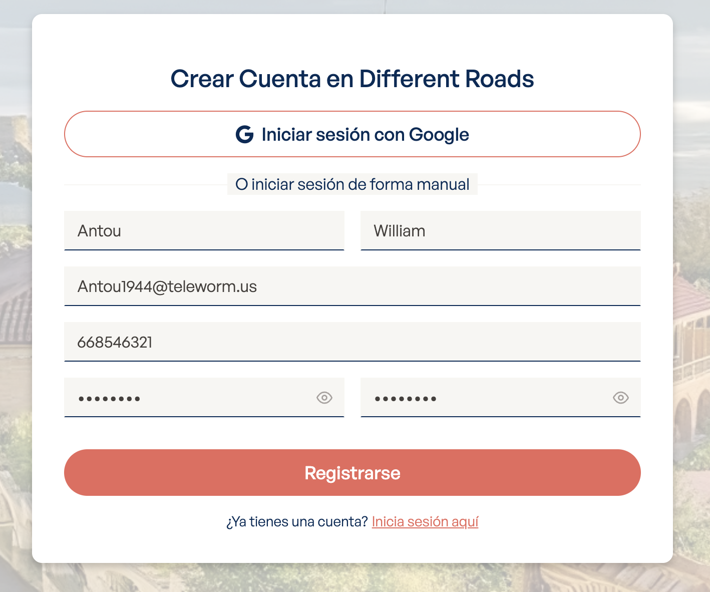
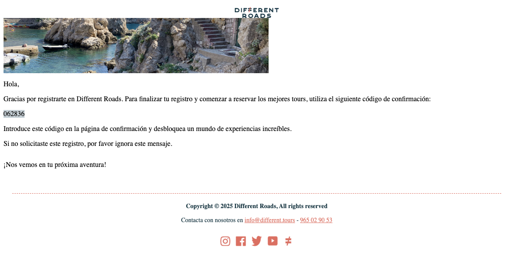
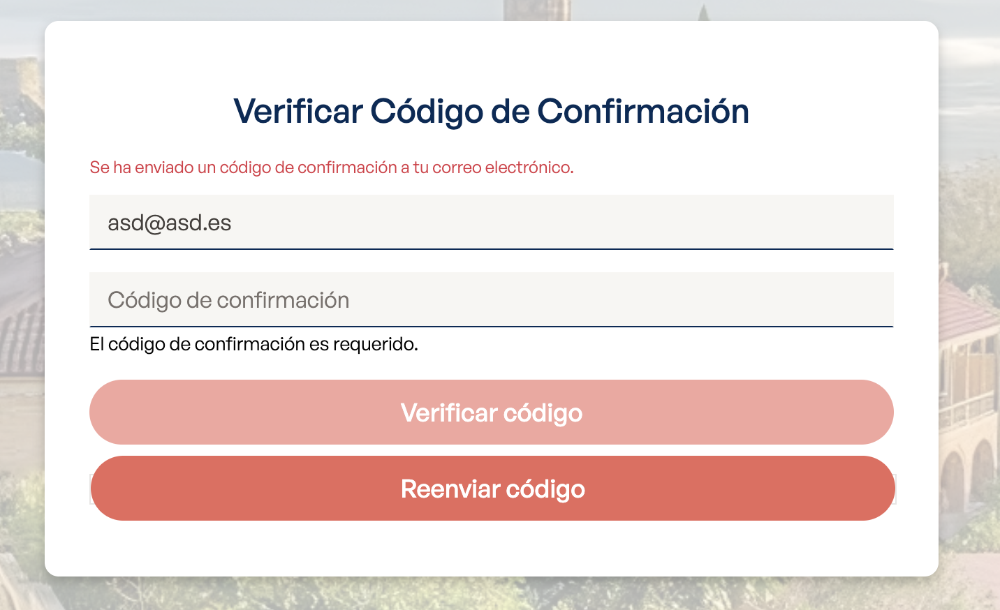
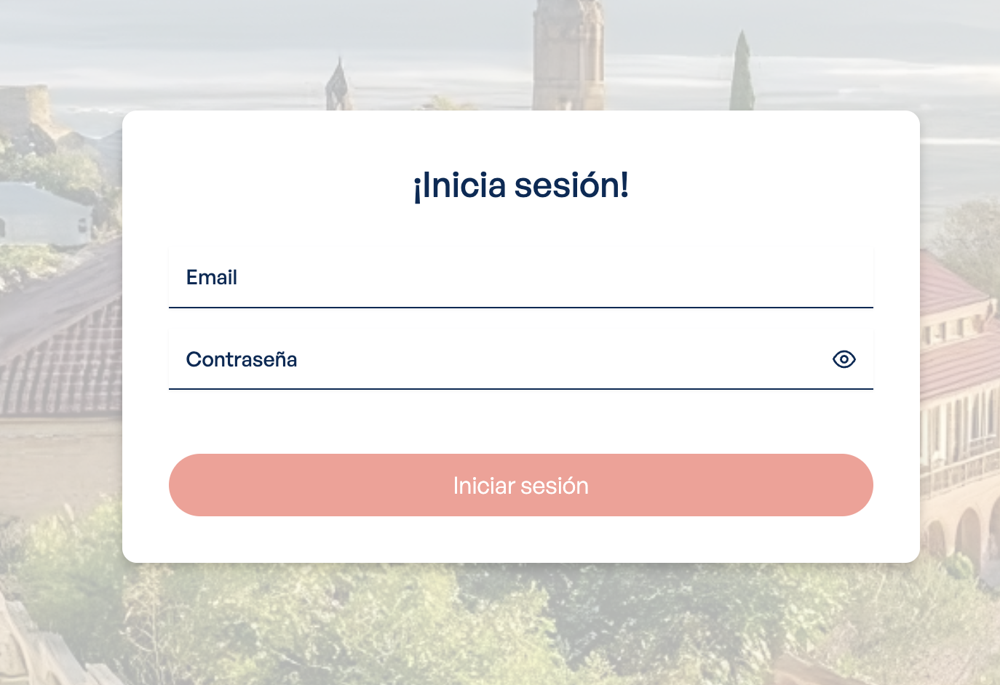
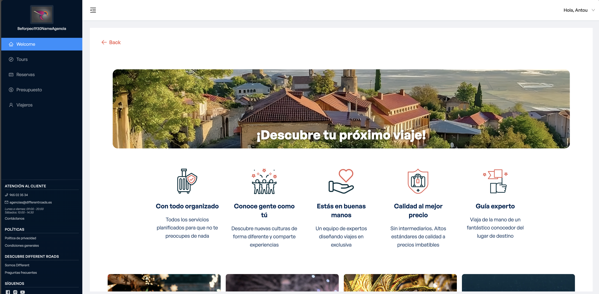

# Proceso de Registro y Login para Agencias

Esta guía explica paso a paso cómo las agencias pueden registrarse y acceder a la plataforma Different Roads.

## Paso 1: Acceder al Formulario de Registro

Primero, debes acceder al siguiente enlace: **https://ui-dev.differentroads.es/sign-up**

## Paso 2: Completar el Formulario de Registro

Rellena todos los campos del formulario con los datos de tu agencia:

**Campos requeridos:**
- Nombre y apellidos
- Email de la agencia
- Número de teléfono
- Contraseña (confirmar)

Una vez completados todos los campos, haz clic en el botón **"Registrarse"**.

## Paso 3: Verificar el Código de Confirmación

Después del registro, recibirás un email con un código de verificación:

**Nota:** Guarda este código, lo necesitarás en el siguiente paso.

## Paso 4: Introducir el Código de Verificación

En la página de verificación, introduce el código que recibiste por email:

Haz clic en **"Verificar código"** para continuar.

## Paso 5: Login en la Plataforma

Una vez verificada tu cuenta, serás redirigido a la página de login de touroperación: **https://touroperacion-dev.differentroads.es**

Introduce tus credenciales (email y contraseña) y haz clic en **"Iniciar sesión"**.

## Paso 6: Acceso Completo a la Plataforma

¡Perfecto! Ya tienes acceso completo a la plataforma Different Roads:

**Desde aquí podrás:**
- Gestionar tours
- Ver reservas
- Consultar presupuestos
- Administrar viajeros
- Acceder a todas las funcionalidades de la plataforma

---

## Soporte

Si tienes problemas durante el proceso, contacta con el equipo de soporte:
- **Email:** agencias@differentroads.es
- **Teléfono:** 965 02 35 34
